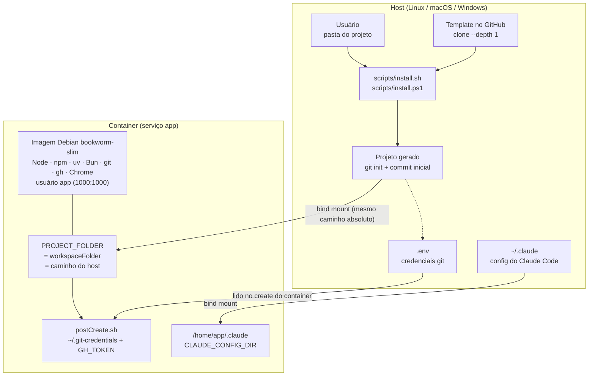
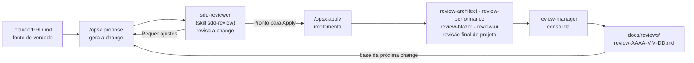

# devc-debian-claude


Esqueleto (template) de projeto que entrega um ambiente de desenvolvimento e prototipação já
montado: um **Devcontainer baseado em Debian com o Claude Code instalado**, ferramentas de
desenvolvimento e um catálogo de skills e plugins prontos para serem habilitados.

O entregável central é um **instalador de um comando** que, executado dentro da pasta onde o novo
projeto deve nascer, baixa tudo o que é necessário e deixa um repositório git novo pronto para ser
aberto no devcontainer — sem repetir manualmente a montagem da base a cada projeto.

> A fonte de verdade do produto é o [`.claude/PRD.md`](.claude/PRD.md) (o quê e por quê).
> As convenções de trabalho no repositório estão no [`CLAUDE.md`](CLAUDE.md) (como).

---

## Índice

- [Descrição](#descrição)
- [Objetivo](#objetivo)
- [Tecnologias utilizadas](#tecnologias-utilizadas)
- [Arquitetura simplificada](#arquitetura-simplificada)
- [Estrutura de pastas](#estrutura-de-pastas)
- [Funcionalidades implementadas](#funcionalidades-implementadas)
- [Como executar o projeto](#como-executar-o-projeto)
- [Ciclo de trabalho e revisão (SDD)](#ciclo-de-trabalho-e-revisão-sdd)
- [Manutenção do ambiente](#manutenção-do-ambiente)
- [Capturas de tela sugeridas](#capturas-de-tela-sugeridas)
- [Fora do escopo](#fora-do-escopo)
- [Próximas evoluções](#próximas-evoluções)

---

## Descrição

`devc-debian-claude` não é uma aplicação: é o **ponto de partida** de outras aplicações. Ele reúne,
em um repositório só, três coisas que normalmente se remontam à mão a cada projeto novo:

1. **Uma imagem de desenvolvimento** Debian enxuta, com o ferramental já instalado e usuário
   não-root.
2. **A configuração de Devcontainer** que conecta essa imagem ao VS Code e ao Claude Code,
   compartilhando a configuração do Claude Code do host com o container.
3. **Um bootstrap de um comando** (`scripts/install.sh` / `scripts/install.ps1`) que materializa um
   projeto novo a partir do template, já com repositório git inicializado.

Uma restrição estrutural atravessa todo o produto: **a pasta do projeto no host, o
`workspaceFolder` do devcontainer e o `PROJECT_FOLDER` do `docker-compose.yml` são o mesmo caminho
absoluto**. É isso que faz o Claude Code enxergar o projeto sob o mesmo caminho nos dois lados,
mantendo continuidade de configuração, memória e sessões entre host e container.

## Objetivo

Sair do zero para um ambiente de desenvolvimento padronizado em um único comando, de forma
reprodutível e sem passos manuais escondidos.

- Fornecer um instalador de um comando para Linux/macOS e Windows que colete os dados do novo
  projeto e entregue um repositório git inicializado.
- Garantir **paridade de caminho** entre host e container.
- Entregar uma imagem de desenvolvimento enxuta e estável, com usuário não-root.
- Compartilhar a configuração do Claude Code do host com o container, preservando credenciais,
  plugins e memória entre rebuilds.
- Manter skills e plugins **declarados mas não impostos**: versionados no template e desativáveis
  por projeto, para não poluir o container com o que aquele projeto não usa.

**Público-alvo:** quem inicia projetos novos com frequência; quem usa Claude Code e quer o mesmo
ambiente no host e no container; desenvolvedores de dados/infra que aproveitam o catálogo de skills
já versionado; e times que precisam de ambiente reprodutível entre Linux, macOS e Windows.

## Tecnologias utilizadas

| Camada | Tecnologia | Papel |
|---|---|---|
| Base | **Debian bookworm-slim** | Imagem enxuta e estável |
| Orquestração | **Docker Compose** + **Dev Containers** (VS Code) | Sobe o serviço `app` e o conecta ao editor |
| Assistente | **Claude Code** (feature `ghcr.io/anthropics/devcontainer-features/claude-code`, versão travada `1.0.5`) | Assistente de código dentro do container |
| JavaScript | **Node.js LTS** + **npm**, **Bun** | Runtimes e gerenciadores |
| Python | **uv** | Gerenciador de dependências/ambiente |
| Git/GitHub | **git**, **GitHub CLI (`gh`)** | Versionamento e automação do GitHub |
| Navegador | **Google Chrome** | Automação de navegador (ex.: skill `playwriter`) |
| Observabilidade de uso | **ccusage** (npm), **claude-usage** (uv tool) | Monitoramento de consumo de tokens |
| Utilidades | `sudo`, `zip`, `unzip`, `xz-utils`, locale `C.UTF-8` | Suporte geral e acentuação correta |
| Bootstrap | **Bash** (`install.sh`) e **PowerShell** (`install.ps1`) | Instaladores equivalentes |

Reprodutibilidade: as versões são travadas em
[`.devcontainer/devcontainer-lock.json`](.devcontainer/devcontainer-lock.json) (feature do Claude
Code) e [`skills-lock.json`](skills-lock.json) (origem, caminho e hash de cada skill).

## Arquitetura simplificada

Duas etapas independentes: o **bootstrap**, que roda no host e gera o projeto; e o **ambiente**,
que roda em container e é onde o desenvolvimento acontece.



Pontos que sustentam a arquitetura:

- **Paridade de caminho** — `PROJECT_FOLDER` (em `.devcontainer/.env`) e `workspaceFolder` (em
  `.devcontainer/devcontainer.json`) recebem o mesmo caminho absoluto, gravado pelo instalador. Se
  divergirem, a instalação é inválida.
- **Configuração do Claude Code no host** — `~/.claude` do host é montado em `/home/app/.claude`,
  com `CLAUDE_CONFIG_DIR` apontando para lá. Configuração, plugins, credenciais e memória
  sobrevivem a rebuilds porque residem no host.
- **Segredos fora da imagem** — as credenciais git vivem no `.env` da raiz (não versionado) e são
  materializadas dentro do container a cada criação, pelo `postCreate.sh`, em arquivos `600`.
- **Helper de credenciais determinístico** — o `devcontainer.json` zera a lista cumulativa de
  `credential.helper` e define `store` como único helper, e desliga a cópia do gitconfig do host.
  Sem isso o push dentro do container falha por não haver UI para o fluxo de autenticação do host.
- **Usuário não-root** — a imagem cria `app` (UID/GID 1000) e o compose sobe com
  `user: ${HOST_UID:-1000}:${HOST_GID:-1000}`, de modo que a escrita no workspace montado não
  esbarre em permissão.

## Estrutura de pastas

Marcação: `[i]` = copiado para o projeto gerado pelo instalador · `[t]` = existe apenas no template ·
`[g]` = gerado pelo instalador ou pelo uso, não versionado.

```text
devc-debian-claude/
    .devcontainer/              [i] diretório completo
        Dockerfile              < imagem Debian + Node/uv/Bun/gh/Chrome, usuário app
        docker-compose.yml      < serviço "app", parametrizado pelo .env
        devcontainer.json       < feature claude-code, bind de ~/.claude, locale, git helper
        postCreate.sh           < credenciais git + GH_TOKEN a partir do .env da raiz
        devcontainer-lock.json  < versão travada da feature claude-code
        .env.example            < DOCKER_IMAGE_NAME / DOCKER_IMAGE_TAG / CONTAINER_NAME / PROJECT_FOLDER
        .env                    [g] gerado pelo instalador
    .claude/                    [i] exceto settings.local.json, PRD.md e skills/
        settings.json           [i] hooks (bell ao terminar/notificar)
        agents/                 [i] subagentes; hoje só sdd-reviewer.md (revisão antes do Apply)
        PRD.md                  [t] fonte de verdade do produto; não copiado nem regerado no projeto gerado
        settings.local.json     [g] skills desativadas neste projeto (não versionado)
        skills/                 [t] symlinks para ../../.agents/skills/*
            sdd-review/         < processo de revisão de change OpenSpec (pasta real, não symlink)
    .agents/                    [t] não copiado para o projeto gerado
        skills/                 < skills instaladas via npx skills (uma pasta por skill)
    scripts/                    [i] diretório completo
        install.sh              < bootstrap Linux/macOS
        install.ps1             < bootstrap Windows/PowerShell
        install-skill.sh        < catálogo de skills instaláveis
        plugins.sh              < catálogo de plugins/MCPs sob demanda
        clean.sh                < remove container e volumes deste devcontainer
    prompts/                    [i] diretório completo — prompts numerados na ordem de uso
        1-create-prd.md         < gera o PRD do projeto
        2-create-claude.md      < gera o CLAUDE.md do projeto
        3-create-agents.md      < gera os subagentes review-* (revisão final)
        4-create-readme.md      < gera o README do projeto
        5-new-feature-script.md < roteiro de nova funcionalidade (vazio; ver observação abaixo)
        6-final-review.md       < aciona os review-* e o review-manager
    skills-lock.json            [i] lock das skills instaladas
    .env.example                [i] credenciais git (modelo)
    .gitignore                  [i]
    .env                        [g] credenciais git, preenchido pelo usuário
    CLAUDE.md                   [t] guia de trabalho no repositório
    README.md                   [t] este arquivo
```

O projeto gerado recebe **apenas** os itens `[i]`. É uma lista fechada: `README.md`, `CLAUDE.md`, o
`.claude/PRD.md` do template, o `settings.local.json` e o diretório `.agents/skills/` ficam de
fora. O `.claude/PRD.md` **não** é regerado como esqueleto — o projeto nasce sem PRD, a ser escrito
pelo usuário a partir de [`prompts/1-create-prd.md`](prompts/1-create-prd.md).

> `prompts/5-new-feature-script.md` existe mas está **vazio**: o roteiro de nova funcionalidade
> ainda não foi escrito. Os demais prompts numerados estão completos.

## Funcionalidades implementadas

| # | Funcionalidade | O que faz |
|---|---|---|
| RF1 | **Bootstrap por um comando** | Clona o template com `--depth 1`, descarta o `.git` do template, copia os itens e entrega um repositório git novo com commit inicial |
| RF2 | **Coleta de dados do projeto** | Pergunta nome e descrição (prompt, flags ou variáveis de ambiente); o nome do container é **derivado** do nome do projeto, não perguntado |
| RF3 | **Paridade de caminho** | Grava o mesmo caminho absoluto em `PROJECT_FOLDER` e `workspaceFolder`; caminho relativo aborta a instalação |
| RF4 | **Geração do `.devcontainer/.env`** | Gera o `.env` a partir do `.env.example`, com `DOCKER_IMAGE_NAME`, `CONTAINER_NAME` e `PROJECT_FOLDER` |
| RF5 | **Personalização do `devcontainer.json`** | Reescreve `name`, `description` e `workspaceFolder` preservando os comentários do arquivo (JSONC) |
| RF6 | **Lista fechada de itens copiados** | Copia item a item, validando tudo antes de começar; descarta symlinks que ficariam quebrados |
| RF7 | **Ambiente do container** | Debian bookworm-slim com Node LTS, npm, uv, Bun, git, gh, sudo, Chrome, ccusage, claude-usage, locale UTF-8 e usuário `app` |
| RF8 | **Config do Claude Code compartilhada** | Bind mount de `~/.claude` do host e `CLAUDE_CONFIG_DIR=/home/app/.claude` |
| RF9 | **Credenciais git e `GH_TOKEN`** | O `postCreate.sh` recria `~/.git-credentials` (`600`) e o `GH_TOKEN` a partir do `.env`; sem `.env`, pula com mensagem e termina com sucesso |
| RF10 | **Catálogo sob demanda** | Skills versionadas e desativáveis por projeto; plugins/MCPs **nunca** instalados automaticamente |
| RF11 | **Limpeza do ambiente** | `clean.sh` remove container e volumes do projeto, preservando o volume compartilhado `vscode` |
| RF12 | **Trilha de revisão SDD** | Duas camadas somente-leitura: `sdd-reviewer` + skill `sdd-review` entre o `/opsx:propose` e o `/opsx:apply`; subagentes `review-*` na revisão final. Ver [Ciclo de trabalho e revisão (SDD)](#ciclo-de-trabalho-e-revisão-sdd) |

Requisitos não-funcionais atendidos: portabilidade (bash e PowerShell), idempotência do
`postCreate.sh`, segredos em arquivos `600` com `.env` fora do git, imagem enxuta
(`--no-install-recommends` e limpeza das listas do apt), versões travadas em arquivos de lock e
mensagens em português com locale `C.UTF-8`.

> **Sobre "fluxo do simulador da Copa" e "regras de propagação do mata-mata":** esses dois itens
> vieram do modelo de prompt em [`prompts/4-create-readme.md`](prompts/4-create-readme.md), herdado
> de outro projeto. Não há simulador de Copa nem chaveamento de mata-mata neste repositório — o
> produto é um template de devcontainer — e por isso as seções correspondentes não existem. O fluxo
> equivalente aqui é o de bootstrap, descrito em [Como executar o projeto](#como-executar-o-projeto).

## Como executar o projeto

### Pré-requisitos

- **Docker** em execução no host.
- **VS Code** com a extensão **Dev Containers**.
- **git** disponível no `PATH` (exigido pelos instaladores).
- Arquitetura **amd64** (Chrome e `gh` são instalados com `arch=amd64` fixo).

### 1. Criar o projeto a partir do template

**Linux / macOS**

```bash
mkdir -p /caminho/do/meu-projeto && cd /caminho/do/meu-projeto
curl -fsSL https://raw.githubusercontent.com/scarlosfreitas/devc-debian-claude/main/scripts/install.sh | bash
```

**Windows (PowerShell)**

```powershell
New-Item -ItemType Directory -Force -Path C:\code\meu-projeto | Set-Location
irm https://raw.githubusercontent.com/scarlosfreitas/devc-debian-claude/main/scripts/install.ps1 | iex
```

O instalador pergunta três coisas — **nome do projeto**, **descrição** e **caminho do projeto**
(padrão: a pasta atual) — e então gera o `.devcontainer/.env`, personaliza o `devcontainer.json`,
roda `git init` e faz o commit inicial. O projeto nasce **sem** `.claude/PRD.md`: escreva o seu a
partir de [`prompts/1-create-prd.md`](prompts/1-create-prd.md).

<details>
<summary>Modo não-interativo e opções</summary>

**Linux / macOS** — flags de linha de comando:

```bash
curl -fsSL .../scripts/install.sh | bash -s -- \
  --name "Meu Projeto" \
  --description "Descrição do projeto" \
  --project-folder /caminho/do/meu-projeto \
  --yes
```

| Opção | Efeito |
|---|---|
| `--dir <path>` | Diretório de destino (padrão: `.`) |
| `--name <texto>` | Nome do projeto |
| `--description <texto>` | Descrição, gravada no `devcontainer.json` |
| `--project-folder <path>` | Caminho absoluto usado em `PROJECT_FOLDER` e `workspaceFolder` |
| `--repo-url <url>` / `--branch <nome>` | Origem do template |
| `-y`, `--yes`, `--force` | Sem prompts; permite diretório não vazio |
| `--no-commit` | Só `git init`, sem commit inicial |

**Windows** — como `irm | iex` não aceita parâmetros, use variáveis de ambiente
(`INSTALL_NAME`, `INSTALL_DESCRIPTION`, `INSTALL_PROJECT_FOLDER`, `INSTALL_DIR`,
`INSTALL_REPO_URL`, `INSTALL_BRANCH`, `INSTALL_YES`, `INSTALL_NO_COMMIT`) ou baixe o script e passe
os parâmetros normais (`-Name`, `-Description`, `-ProjectFolder`, `-Yes`, `-NoCommit`).

</details>

O nome do projeto é normalizado para virar o nome da imagem e do container: `Meu Projeto Novo` →
`meu-projeto-novo`.

### 2. Preencher as credenciais git

```bash
cp .env.example .env
```

| Variável | Uso |
|---|---|
| `GIT_USERNAME` | Usuário do GitHub (compõe o `~/.git-credentials`) |
| `GIT_EMAIL` | E-mail do autor dos commits |
| `GIT_NAME` | Nome do autor dos commits |
| `GIT_TOKKEN` | Token de acesso; também vira `GH_TOKEN` para a `gh` CLI |

> O `.env` e o `.devcontainer/.env` são ignorados pelo git. O instalador **não** preenche o `.env`
> da raiz: por conter segredo, o preenchimento é manual.

### 3. Abrir no devcontainer

1. Abra a pasta no VS Code.
2. `Ctrl+Shift+P` → **Dev Containers: Reopen in Container**.
3. Na criação do container, o `postCreate.sh` recria `~/.git-credentials` e o `GH_TOKEN`.
4. Faça login no Claude Code.

### 4. Conferir o ambiente

```bash
whoami     # app
locale     # C.UTF-8
pwd        # o mesmo caminho absoluto do host
for c in node npm uv bun git gh sudo ccusage claude-usage; do command -v "$c"; done
gh auth status
```

## Ciclo de trabalho e revisão (SDD)

O template não entrega só o ambiente: entrega também a **trilha de Spec-Driven Development** que se
usa dentro dele, com o OpenSpec no centro e **duas camadas de revisão independentes**, que atuam em
momentos diferentes e com escopos diferentes.



### Camada 1 — revisão da change, antes do Apply

Revisa **os artefatos da change**, não o código: a especificação ainda vai ser implementada.

| Peça | Papel |
|---|---|
| [`.claude/skills/sdd-review/SKILL.md`](.claude/skills/sdd-review/SKILL.md) | A **skill**: define o processo de revisão em seis etapas |
| [`.claude/agents/sdd-reviewer.md`](.claude/agents/sdd-reviewer.md) | O **subagente** que executa esse processo, usando a skill como guia |

**Quando executar:** depois do `/opsx:propose` e **antes** do `/opsx:apply`. É esse o ponto em que
corrigir sai barato — depois do Apply, cada inconsistência da spec já virou retrabalho de código.

O subagente lê `proposal.md`, `design.md`, `tasks.md`, `specs/` e o `CLAUDE.md` do projeto, tratando-os
como única fonte de verdade, e percorre as seis etapas da skill:

| Etapa | O que procura |
|---|---|
| **Consistência** | Requisitos conflitantes, funcionalidade descrita em um só artefato, tarefa sem requisito, requisito sem tarefa |
| **Escopo** | Change grande demais, funcionalidades que deveriam virar changes separadas, dependências entre elas |
| **Arquitetura** | Violações do `CLAUDE.md`, estrutura de pastas inconsistente, componentes grandes demais, acoplamento |
| **Implementação** | Dependências, serviços, entidades e casos de uso ausentes; fluxos incompletos |
| **Banco de dados** | Entidades incompletas, relacionamentos ausentes, dados não previstos |
| **Riscos** | Classificação baixo/médio/alto, ambiguidades e decisões não documentadas |

O relatório sai em quatro seções — **Pontos Positivos**, **Problemas Encontrados**, **Recomendações**
e **Conclusão** — e a conclusão é binária: *Pronto para Apply* ou *Requer ajustes antes do Apply*.

O `sdd-reviewer` é **estritamente somente leitura** (`tools: Read, Grep, Glob`, com Write/Edit/Bash
explicitamente negados). Mesmo diante de um erro trivial ele não corrige: apenas registra o problema
com a localização exata. Isso é deliberado — a decisão de aplicar qualquer correção fica com o
desenvolvedor, fora da revisão, e um revisor que edita deixa de ser um controle independente.

### Camada 2 — revisão final do projeto, entre ciclos

Revisa **o projeto implementado**, e vai muito além do código: arquitetura, desempenho, ciclo de
vida do framework, UX e acessibilidade. Os subagentes são criados pelo prompt
[`prompts/3-create-agents.md`](prompts/3-create-agents.md) e acionados pelo prompt
[`prompts/6-final-review.md`](prompts/6-final-review.md).

| Subagente | Área exclusiva |
|---|---|
| `review-architect` | Organização do projeto, separação de responsabilidades, SOLID, acoplamento, coesão, duplicação |
| `review-performance` | Consultas LINQ/EF Core, consultas repetidas, cache, alocações, renderizações, complexidade |
| `review-blazor` | `RenderMode`, ciclo de vida dos componentes, `StateHasChanged`, `JSInterop`, `RenderFragment`, prerendering |
| `review-ui` | UX, navegação, consistência visual, responsividade, Bootstrap, acessibilidade |
| `review-manager` | Consolida os relatórios — **não analisa código** |

Três regras sustentam esse desenho:

- **Independência total.** Cada especialista atua só na sua área. Ao encontrar um problema fora
  dela, apenas o menciona como observação, sem recomendar nada a respeito.
- **Nenhum deles escreve código nem altera arquivos.** O produto da revisão é um relatório técnico,
  não um patch.
- **O `review-manager` não reinterpreta.** Ele consolida, agrupa semelhantes, elimina duplicatas,
  aponta conflitos entre recomendações e prioriza — sem alterar as conclusões técnicas dos
  especialistas.

Todos usam o mesmo formato de relatório: **Resumo Executivo**, **Problemas encontrados**
(localização, descrição, justificativa), **Impacto**, **Recomendação** (conceitual, sem código) e
**Prioridade** (Alta/Média/Baixa).

O consolidado do `review-manager` sai em `docs/reviews/review-AAAA-MM-DD.md`, com um resumo
executivo no terminal, e sua última seção — *Próximos Passos* — propõe como organizar as melhorias
em uma nova change do OpenSpec. É assim que a revisão final **realimenta** o ciclo: o relatório vira
a base do próximo `/opsx:propose`.

> **Os subagentes da camada 2 são específicos de stack.** Como estão escritos hoje,
> `3-create-agents.md` e `6-final-review.md` pressupõem **Blazor Web App, .NET 10, Bootstrap,
> JSInterop e prerendering** — vieram de um projeto ASP.NET Core. Em um projeto de outra stack,
> `review-blazor` deve ser substituído pelo equivalente (`review-react`, `review-django`, …) e os
> critérios de `review-performance` e `review-ui` ajustados antes de gerar os agentes. A **camada 1
> é agnóstica de stack** e funciona em qualquer projeto. Vale a mesma ressalva do `sdd-reviewer`
> versionado no template: seu texto cita o projeto de origem (Copa2026), e o prompt do projeto novo
> deve ser reescrito na primeira execução.

## Manutenção do ambiente

```bash
bash scripts/clean.sh        # lista e remove container e volumes deste devcontainer
bash scripts/clean.sh -y     # sem confirmação
```

O volume compartilhado `vscode` (cache do VS Code Server, comum a todos os devcontainers da
máquina) nunca é removido.

**Skills e plugins** — [`scripts/install-skill.sh`](scripts/install-skill.sh) e
[`scripts/plugins.sh`](scripts/plugins.sh) são **catálogos para copiar linha a linha**, não scripts
para executar por inteiro: instalar tudo polui o container. Para desativar uma skill sem removê-la
do repositório, marque-a em `.claude/settings.local.json`:

```json
{
  "skillOverrides": {
    "dagster-expert": "off"
  }
}
```

O catálogo versionado cobre infraestrutura (Docker, Proxmox, devcontainer), dados (Kafka, Dagster,
medallion pipeline), bancos (Postgres, Oracle), programação (MCP server, Azure App Service),
documentação (Context7) e navegação (Playwriter).

## Capturas de tela sugeridas

Este projeto não tem interface gráfica; as capturas mais úteis são do terminal e do VS Code.
Sugestões, na ordem em que aparecem no fluxo:

| # | Captura | O que deve aparecer |
|---|---|---|
| 1 | **Instalador em execução** | As perguntas de nome, descrição e caminho, e o resumo final com o container e o `PROJECT_FOLDER` |
| 2 | **Projeto recém-gerado** | `ls -a` mostrando os itens instalados e o `git log` com o commit inicial |
| 3 | **Reopen in Container** | A paleta de comandos do VS Code com *Dev Containers: Reopen in Container* |
| 4 | **`postCreate.sh` no log** | As linhas de configuração das credenciais git e do `GH_TOKEN` |
| 5 | **Paridade de caminho** | `pwd` no terminal do container exibindo o mesmo caminho absoluto do host |
| 6 | **Ferramentas disponíveis** | A saída do laço de `command -v` e do `whoami`/`locale` |
| 7 | **Claude Code em sessão** | O Claude Code rodando no terminal integrado, dentro do container |
| 8 | **`clean.sh`** | A lista de alvos e a confirmação de remoção |

Convenção sugerida: guardar as imagens em `docs/img/` e referenciá-las com caminho relativo, por
exemplo ``.

## Fora do escopo

Não fazem parte da primeira versão:

- Infraestrutura de produção (Dockerfile/compose de produção na raiz).
- Instalação automática de plugins e MCPs no container.
- Suporte a arquiteturas diferentes de `amd64`.
- Testes automatizados dos instaladores.

## Próximas evoluções

- Estrutura documental de referência (`docs/domain/`, `docs/standards/`, `docs/guidelines/`), além
  de `src/`, `test/` e `STATUS.md`.
- Generalizar os subagentes de review da camada 2
  ([`prompts/3-create-agents.md`](prompts/3-create-agents.md) e
  [`prompts/6-final-review.md`](prompts/6-final-review.md)), hoje presos à stack Blazor/.NET, e
  neutralizar a referência ao projeto de origem no `sdd-reviewer.md`.
- Escrever o `prompts/5-new-feature-script.md`, hoje vazio.
- Preenchimento automático do `.env` da raiz pelo instalador, hoje manual por conter segredo.
- Suporte multiarquitetura (`arm64`) na imagem de desenvolvimento.
- Testes automatizados do bootstrap (`install.sh` / `install.ps1`) em CI — hoje o `install.ps1` é
  validado apenas manualmente, por espelhamento do `install.sh`.
- Seleção interativa de skills e plugins durante a instalação.

---

## Documentos relacionados

| Documento | Conteúdo |
|---|---|
| [`.claude/PRD.md`](.claude/PRD.md) | Requisitos com cenários verificáveis e critérios de aceitação |
| [`CLAUDE.md`](CLAUDE.md) | Convenções de trabalho no repositório e estado de conformidade com o PRD |
| [`prompts/`](prompts/) | Prompts que geraram o PRD, o `CLAUDE.md`, os subagentes e este README |
